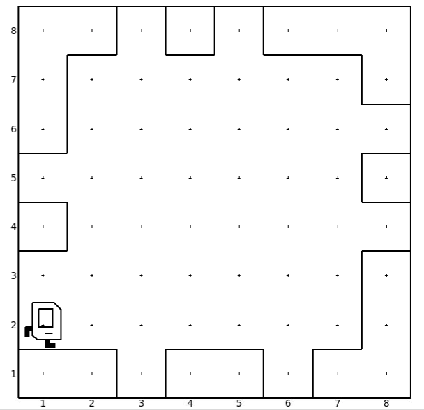

# Concepts
* Introduction
* Main Function
* Comments
* Basic Karel Commands
* Functions
* Decomposition


# Introduction

Karel is a cool robot. It can move around the world. Karel has a bag in which it collects beepers. It can also take beepers from its bag and put them on the floor. Karel has a space it can move in which is surrounded by walls.

# Main functions

`def main()` block is like the green flag block in scratch. It contains the commands to be executed.

```python
def main():
  move()
```

# Comments

`#` symbol is used to comment out code. Color of comments is grey.
```python
# This is a comment
```


# Basic Karel Commands

A command is like a block in scratch but we just write it with words.

* `move()`: move karel forward.
* `turn_left()`: make karel turn counter clockwise.
* `pick_beeper()`: pickup a beeper and put it in the bag. If a beeper does not exist, karel gets an error.
* `put_beeper()`: Put beeper from karel's bag.

##  Exercise 0

  The task is to pick up the beeper. The goal is to introduce basic commands: `move()`, `turn_left()`, `pick_beeper()`. You may prepare this world beforehand or use the file `introduction.w`.

  

## Exercise 1

  The task is to collect all beepers. The goal is to make sure the student can use the basic commands introduced earlier. You may prepare this world before hand or use `1_exercise.w` file.

  


# Introducing Functions

Exercise 2 will introduce a problem which requires karel to turn right. The student should implement it using 3 turn left commands. Exercise 3 will introduce the option of creating a function `turn_right()` to make the code simpler.

## Exercise 2

The task is take the beeper from (2, 1) and place it in the middle of the table at (5, 2). World used is `2_function_intro.w`.


## Exercise 3

This is the same as exercise 2, but the `turn_right()` function must be implemented and used.


## Exercise 4

  The task is to collect all the beepers. The code should not contain any two consective commands which are the same. Functions should be used to encapsulate repeated commands. World used is `3_function_practice.w`

  


# Decomposition

  The idea of decomposition is to divide the program into chunks where each chunk achieves a certain complex task.

## Exercise 5:

  The task is to move from left to right and fill in the holes. First the student should try to implement a naive version. Then discuss with them how we can decompose the required commands into distinct parts of functions and then improve the program my implementing the required functions. Use world `4_decomposition.w`

  


## Exercise 5: Challenge

The task is to fill the holes in all on all the sides by moving circularly around the grid. World is `5_decomposition_challenge.w`



# Accessing World Editor

Can be accessed to create worlds by running the following:

```python
from stanfordkarel.world_editor import run_world_editor

if __name__ == "__main__":
    run_world_editor()
```
