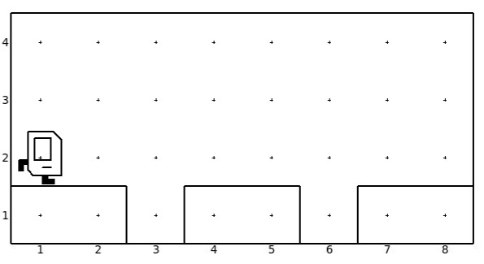
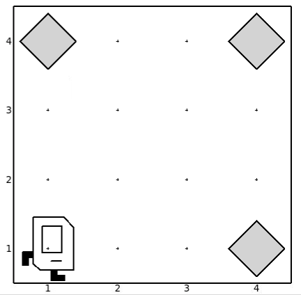

# Concepts
* For Loop


# Decomposition

  The idea of decomposition is to divide the program into chunks where each chunk achieves a certain complex task.

## Exercise 1:

  The task is to move from left to right and fill in the holes. First the student should try to implement a naive version. Then discuss with them how we can decompose the required commands into distinct parts of functions and then improve the program my implementing the required functions. Use world `1_decomposition.w`

  


## Exercise 2:

The task is to fill the holes in all on all the sides by moving circularly around the grid. World is `2_decomposition.w`


# For Loop

For Loop allows us to repeat a block of code for a specified number of times.


```python
for i in range(count):
  statements to be repeated
```

# Exercise 3

  The task is to pick up all the beepers that are placed in the single cell. World to be used is `3_loop.w`

  


# Exercise 4

  The task is to pick the beepers from the corners using a for loop. World to be used is `4_loop_corners`

  


# Exercise 5

The task is to put 7 beepers at each corner.


