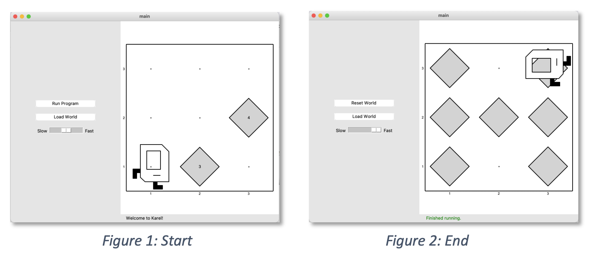
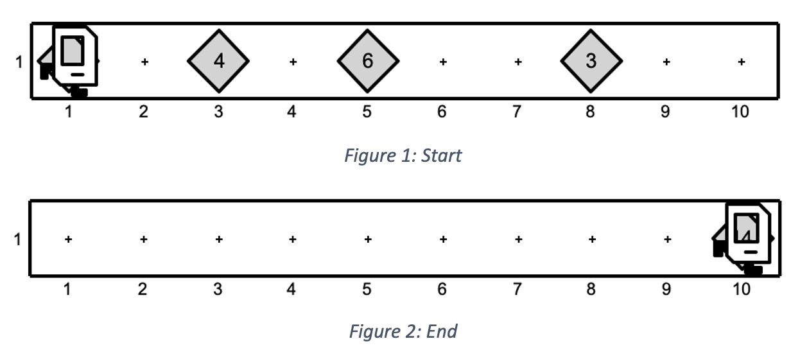
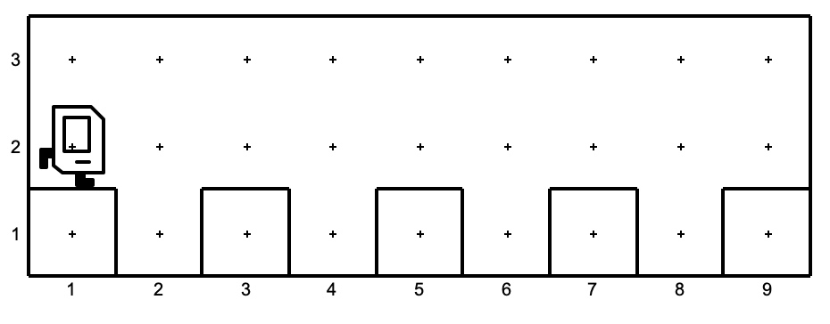
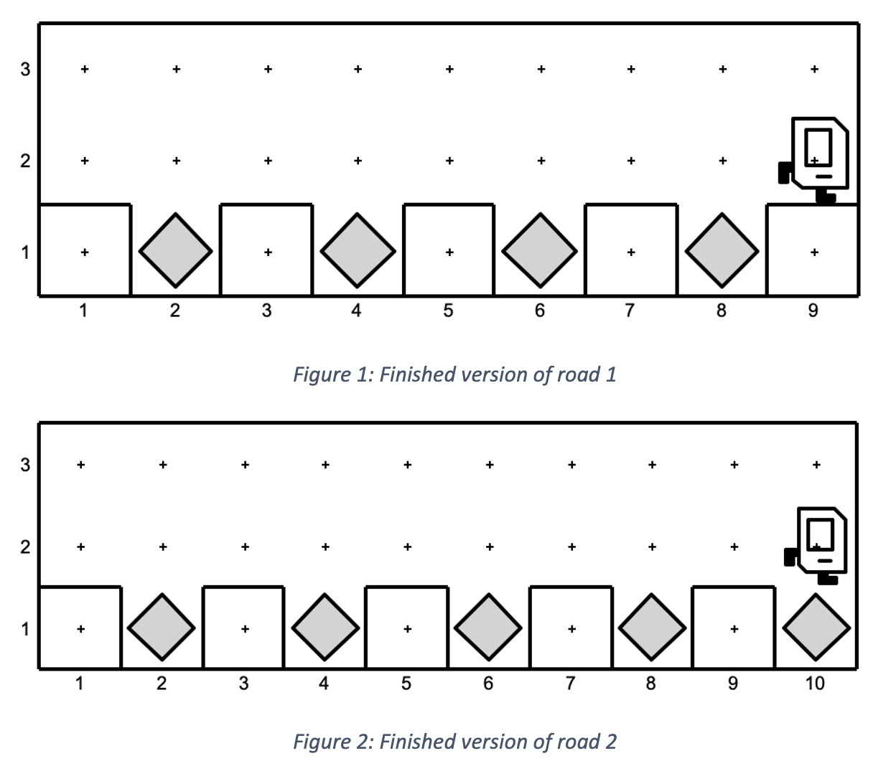

In this session, all the material learned with Karel is internalized through multiple mini projects. You can adjust the problem or the given boilerplate according to the changemaker's age, experience, and performance during previous weeks.

# Challenges

## H for Hub21

Collect the 7 beepers on the corners and arrange them such that H letter is seen on the screen as shown below:

**Figure 1** - H for Hub21 Challenge beginning and end image of the Karel world

### Small Challenge

For H letter to be more visible, also paint the corners you put beeper to YELLOW.

**Figure 2** - H for Hub21 Challenge v2, beginning and end image of the Karel world

## Carry All To the Corner

Karel should pick all the beepers and move them to the end of the corner.

**Figure 3** - Carry All to the Corner, start and finish image of the Karel world

### Small Challenge

If there was at least one beeper for a corner before Karel started moving, Karel should paint that corner to RED, otherwise to GRAY.

**Figure 4** - Carry All to the Corner v2, start and finish image of the Karel world

## Road Repair

Check out the roads given below where holes on the road are evenly spaced along 1st Street at every even-numbered avenue:

**Figure 5** - Example road 1

**Figure 6** - Example road 2

Write a program where Karel fills the holes with a beeper. Your code should work for both worlds!

**Figure 7** - End version of both worlds

## Color Converter

Karel will re-paint the color of a given wall! It should follow the rules given:  
Red -> Blue  
Blue -> Yellow  
Yellow -> Red

**Figure 8** - Start and end version of the wall-1 to be painted

**Figure 9** - Start and end version of the wall-2 to be painted
