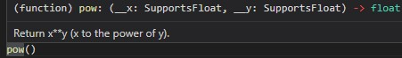

<!-- <style>
img {
    width: 35%;
    float: left;
    padding-right: 10px;
}
</style> -->
# Simple Imports
## Concepts 
- Libraries
- Import Statements
- Using libraries effectively
- Examples using `math` and `random`

### Libraries
**Note** to the tutor: Please refer to [this article](https://www.geeksforgeeks.org/what-is-the-difference-between-pythons-module-package-and-library/) for the difference between module, package, and library.

<!--  -->

- You may start the session by asking student to remind you of why we use functions from last week.   
- *Deliberation:* How can we achieve much more complex functionalities?    
    - How can we go to the moon?   
    - How can we build beautiful websites?   
- No need to re-invent the wheel. Build on the existing cumulative knowledge and functions to create high-value products. $\Rightarrow$  *Libraries*
- There are over 137 000 python libraries.   

### Import Statements
- In order to use a library in our code we first need to load it into our program with `import` statements.
- There are two ways to import:
    - Import the whole library    
    ```python
    import math
    print(math.pow(2, 3))
    ```

    - Import specific functions from the library:
    ```python
    from math import pow
    print(pow(2, 3))
    ```

### Installing Packages
- Some libraries come ready with your Python installation, these are called *built-in modules*. So you can use them directly with `import` statements in your programs. The following are most commonly used built-in libraries in Python.
    ```python
    math, random, os
    ```
- You need to explicitly download other packages. We will start using such packages later in Module 2.

### Using Libraries effectively
- When using a function from library, it is important to understand the inputs, outputs and behavior of the function. 
- Always refer to the documentation if you are not sure how a specific function works.
<!--  -->

- *Pro tip:*Hover over function name and some tips will appear.

# Teaching Tips
- As a general notion, put emphasis on documentation and encourage you students to include comments in their codes.
- Sometimes students may forget the import statements since they are defined at top of the file. You may deliberately forget importing a library and explaing the error, ie:
    ```bash
    NameError: name 'math' is not defined
    ```
- If the student is advanced you may show how to include their own functions from their local files as well.

## Challenges
### Easy
#### Calculate the Square Root
Ease up the student by calculating squareroots of several numbers.


<!--  -->


#### Calculate the perimeter of a circle
Jack will put tape around a hoop to play with his cat. Help Jack find how much tape he needs. We know from math that the perimeter of a circle is given by the following formula: $2\pi r$ where $r$ represents the radius of the circle and $\pi$ is a constant ($3.14159...$). Take $r$ as input from the user andcalculate the result using `math.pi`.

### Medium

#### Combination & Permutation Formulas
Calculate $C(n, k)=\frac{n!}{k!(n-k)!}$ and $P(n, k)=\frac{n!}{(n-k)!}$ using `math.factorial`.  
**Note 1:** A younger student may not know the notion of permutation and combination. Tutor may introduce the formulas as special formulas without explaining the logic. If the tutor feels like the explanation would confuse the student too much, theymay skip this exercise.
**Note 2:** The tutor may direct student to think about how to calculate these formulas without using `math` library as an exercise on for and functions.

### Hard
#### Guess the number game
Let's play a game.
- Generate a random number between $1, 20$ using `random` library. You may use [`random.randint(a, b)`](https://docs.python.org/3/library/random.html#random.randint)
- Ask the user their guess.
- If user's guess is wrong give feedback to the user.
- Repeat until user enters the correct number.
Sample execution:
```bash
Welcome to guess the number game, let's play...
What is your guess? 10
Go lower.
What is your next guess? 5
Go higher.
What is your next guess? 7
Go higher.
What is your next guess? 8
Go higher.
What is your next guess? 9
Congratulations, my number was indeed 9
```


#### Pick a random person and ask them a random question
- Awkward silence in the class? Let's break the ice by letting Python decide who will speak and about what.
- You are given a list of people and questions: 
    ```python
    people = ["Ece", "Gül Sena", "Haldun", "Haydar", "Merve", "Nazir", "Sylvain"]
    questions = ["How old are you?", "Where are you from?", 
                    "What is you favorite color?", "Do you have any siblings?"]
    ```
- For 5 rounds, pick a random person and a random question, and print it to the console.
**Hint:** You may use `random.choice` to pick a random element from a list or `random.randint` to pick a random index.

#### Bingo
Sahra and Cem wants to play Bingo, but they need you to be their dealer:
- First create players cards and inform them about their cards. Each card consists of 6 random numbers between $1$ and $10$.
**Hint:** You may use `radnom.sample(lst, x)` to pick $x$ random elements from $lst$.
- Repeat the following steps until at least one of the players clears off their card.
    - Pick a random number between $1$ and $10$.
    - Check if players have this number in their card, if so remove the number from their card.
- Announce the winner.

- **Bonus:** You may try to substitute Player 1 and 2 with players' names.
- Sample execution:

    ```bash
    Alright, let's play bingo! I am going to assign your cards now:
    Player 1, your card is as follows:  [2, 7, 1, 3, 5, 6]
    Player 2, your card is as follows:  [9, 8, 2, 10, 5, 1]
    The number drawn from the bag is 3
    Player 1 has the number.
    The number drawn from the bag is 6
    Player 1 has the number.
    The number drawn from the bag is 5
    Player 1 has the number.
    Player 2 has the number.
    The number drawn from the bag is 7
    Player 1 has the number.
    The number drawn from the bag is 6
    The number drawn from the bag is 8
    Player 2 has the number.
    The number drawn from the bag is 1
    Player 1 has the number.
    Player 2 has the number.
    The number drawn from the bag is 2
    Player 1 has the number.
    Player 2 has the number.
    Player 1 won.
    ```

# Credits
- Images are taken from [pixabay](pixabay.com)
